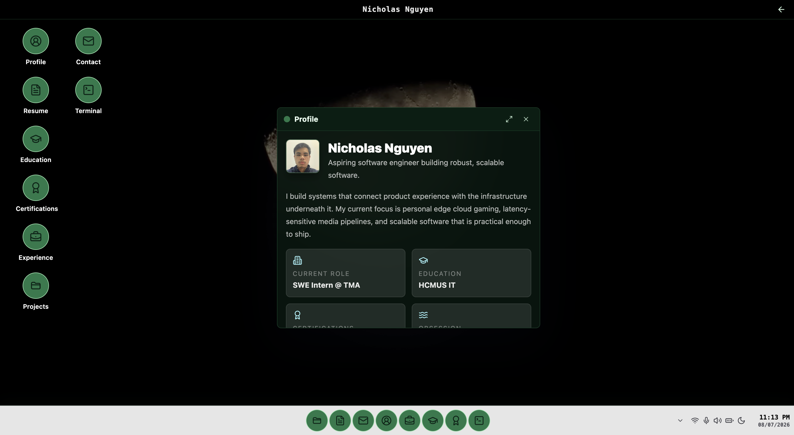

# Nicholas Nguyen | CreatorOS

CreatorOS is my interactive portfolio: a personal desktop-style web page where each part of my profile opens like an app.

Live site: https://nghi-creator.github.io/

<p align="center">
  
</p>

## What It Shows

- Profile, resume, education, certifications, experience, projects, terminal, and contact apps.
- A looping cinematic landing page with a short boot sequence into the desktop.
- Movable, resizable, persistent windows on desktop.
- A dedicated scrollable mobile portfolio for smaller screens.
- Optimized video backgrounds with poster fallbacks for faster first paint.
- Direct recruiter-friendly routes such as `/projects`, `/resume`, and `/contact`.
- A downloadable one-page PDF resume and real product screenshots.

## Tech Stack

- Vite
- React
- TypeScript
- Tailwind CSS
- Lucide React
- GitHub Pages

## Portfolio Blurb

I built CreatorOS as a less generic developer portfolio: instead of presenting a static page, it behaves like a tiny personal operating system. Visitors can open apps for my resume, projects, experience, education, certifications, terminal, and contact links.

## Short Share Copy

CreatorOS is my interactive portfolio: a tiny personal operating system where visitors can open apps for my resume, projects, experience, education, certifications, terminal, and contact links.

Visit: https://nghi-creator.github.io/

## Share Checklist

- Add the live site to LinkedIn Featured.
- Add the live site to LinkedIn contact info.
- Add the live site to the GitHub profile README.
- Add the live site to Dev.to profile links.
- Add the live site to project READMEs for PIXELATED Studio and PIXELATED User.
- Add one screenshot or short GIF preview once the final visual pass is locked.

## Local Development

```bash
npm install
npm run dev
```

## Build

```bash
npm run build
```

## Quality checks

```bash
npm run lint
npm test
```

The GitHub Pages workflow runs linting, interaction and route tests, and the production build before deployment.

## CV files

The downloadable CVs used by the site are `public/NguyenGiaNghi_Industry_CV.pdf`
and `public/NguyenGiaNghi_Academic_CV.pdf`. The older
`scripts/generate_resume.py` utility is an archival one-off generator and does
not update the files served by the portfolio.

## Browser security policy

The document applies a restrictive content security policy and `strict-origin-when-cross-origin` referrer policy through HTML metadata. GitHub Pages provides HTTPS/HSTS, but it does not provide repository-level custom response headers. A `Permissions-Policy` header—and stronger header-only CSP directives such as `frame-ancestors`—should be added if the site moves behind a host or proxy that supports custom headers.
